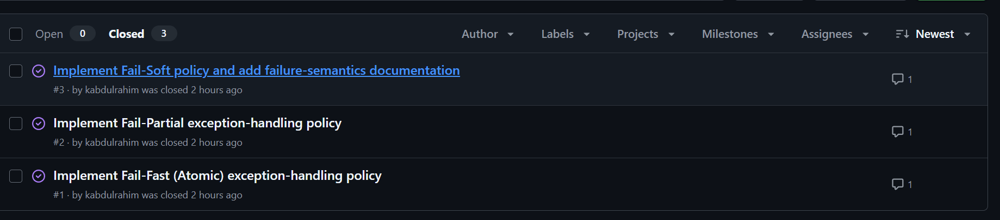
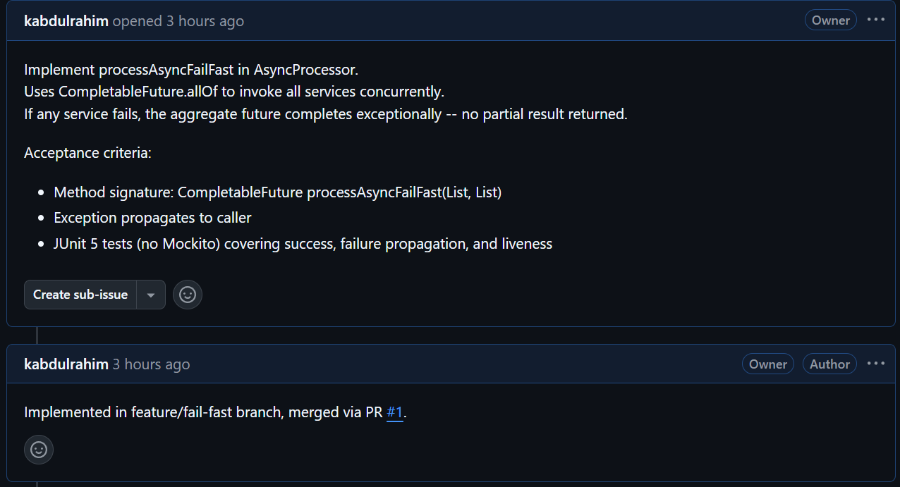
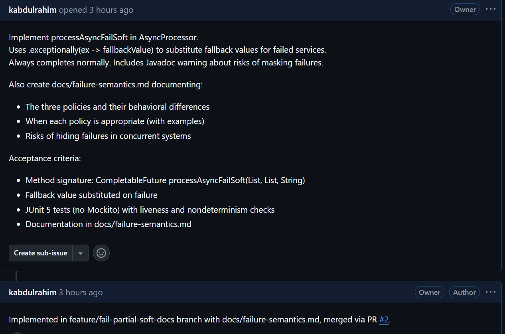
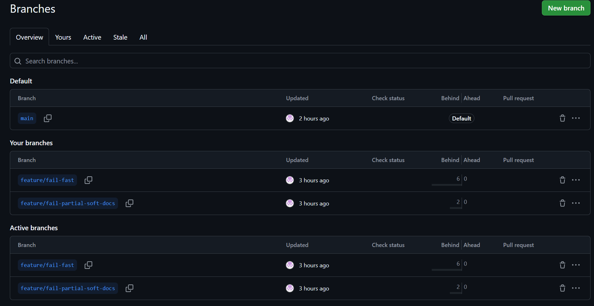

# COEN 6761 - Assignment 1 Report
## Explicit Exception-Handling Policies for Concurrent Execution

**Name:** Khalid Abdulrahim
**Student ID:** 40054836
**Repository:** https://github.com/kabdulrahim/coen448-assignment1

---

## Table of Contents

1. [Task 2 -- Implementation](#task-2----implementation)
2. [Task 3 -- Unit Testing](#task-3----unit-testing)
3. [Task 4 -- Documentation](#task-4----documentation)
4. [Task 5 -- GitHub Workflow](#task-5----github-workflow)
5. [AI Usage Claim](#ai-usage-claim)

---

## Task 2 -- Implementation

### 2.1 Overview

Three explicit exception-handling policies were implemented in `AsyncProcessor.java` to define what happens when concurrent microservice invocations fail:

| Policy | Method | Return Type | On Failure |
|---|---|---|---|
| Fail-Fast | `processAsyncFailFast` | `CompletableFuture<String>` | Entire operation fails, exception propagates |
| Fail-Partial | `processAsyncFailPartial` | `CompletableFuture<List<String>>` | Only successful results returned |
| Fail-Soft | `processAsyncFailSoft` | `CompletableFuture<String>` | Fallback value substituted |

All three methods accept `List<Microservice> services` and `List<String> messages` where each service is paired with its corresponding message by index.

### 2.2 Task A -- Fail-Fast (Atomic Policy)

**Signature:**
```java
public CompletableFuture<String> processAsyncFailFast(
        List<Microservice> services, List<String> messages)
```

**Design:** Uses `CompletableFuture.allOf(...)` to invoke all services concurrently. If any service completes exceptionally, `allOf` propagates the exception and the downstream `thenApply` stage is skipped. No partial result is returned -- the caller receives the exception.

**Key implementation detail:** `CompletableFuture.allOf` inherently provides fail-fast behavior. When any child future fails, the aggregate future completes exceptionally. The `join()` calls inside `thenApply` are safe because they only execute when all futures have already completed successfully.

```java
List<CompletableFuture<String>> futures = new ArrayList<>();
for (int i = 0; i < services.size(); i++) {
    futures.add(services.get(i).retrieveAsync(messages.get(i)));
}

return CompletableFuture.allOf(futures.toArray(new CompletableFuture[0]))
    .thenApply(v -> futures.stream()
        .map(CompletableFuture::join)
        .collect(Collectors.joining(" ")));
```

### 2.3 Task B -- Fail-Partial

**Signature:**
```java
public CompletableFuture<List<String>> processAsyncFailPartial(
        List<Microservice> services, List<String> messages)
```

**Design:** Each future is individually wrapped with `.handle((result, ex) -> ...)` which catches per-service exceptions and converts them to `null` markers. After `allOf` completes, `null` entries are filtered out, leaving only successful results in the list. The aggregate future always completes normally.

**Key implementation detail:** The `.handle()` combinator intercepts both normal and exceptional completion. Failures become `null` values which are filtered by `Objects::nonNull` during aggregation. This means the caller receives a potentially smaller list but never an exception.

```java
List<CompletableFuture<String>> handled = futures.stream()
    .map(f -> f.handle((result, ex) -> {
        if (ex != null) {
            return null;  // mark failure as null
        }
        return result;
    }))
    .collect(Collectors.toList());

return CompletableFuture.allOf(handled.toArray(new CompletableFuture[0]))
    .thenApply(v -> handled.stream()
        .map(CompletableFuture::join)
        .filter(Objects::nonNull)
        .collect(Collectors.toList()));
```

### 2.4 Task C -- Fail-Soft

**Signature:**
```java
public CompletableFuture<String> processAsyncFailSoft(
        List<Microservice> services, List<String> messages,
        String fallbackValue)
```

**Design:** Each future is wrapped with `.exceptionally(ex -> fallbackValue)` which substitutes the caller-supplied fallback value whenever a service fails. The aggregate future always completes normally and always produces a result string with the same number of tokens as the input.

**Key implementation detail:** The `.exceptionally()` combinator provides a recovery path that runs only when the upstream stage fails. The Javadoc includes a warning about the risks of masking failures in production systems.

```java
List<CompletableFuture<String>> futures = new ArrayList<>();
for (int i = 0; i < services.size(); i++) {
    futures.add(
        services.get(i).retrieveAsync(messages.get(i))
            .exceptionally(ex -> fallbackValue)
    );
}

return CompletableFuture.allOf(futures.toArray(new CompletableFuture[0]))
    .thenApply(v -> futures.stream()
        .map(CompletableFuture::join)
        .collect(Collectors.joining(" ")));
```

---

## Task 3 -- Unit Testing

### 3.1 Testing Strategy

All tests follow the strict rules specified in the assignment:

- **No Mockito** -- Instead of mocking, a `FailingMicroservice` subclass is used that overrides `retrieveAsync` to return `CompletableFuture.failedFuture(exception)`. This is possible because both the `Microservice` class and the test classes share the same package (`coen448.computablefuture.test`).
- **All futures awaited with timeouts** -- Every `get()` call uses `get(1, TimeUnit.SECONDS)` or `get(2, TimeUnit.SECONDS)` to prevent tests from hanging.
- **Tests verify policy semantics** -- Each test validates the specific behavioral contract of its policy.

```java
static class FailingMicroservice extends Microservice {
    private final RuntimeException exception;

    FailingMicroservice(String serviceId, RuntimeException exception) {
        super(serviceId);
        this.exception = exception;
    }

    @Override
    public CompletableFuture<String> retrieveAsync(String input) {
        return CompletableFuture.failedFuture(exception);
    }
}
```

### 3.2 Test Summary

| Test Class | # Tests | Categories Covered |
|---|---|---|
| `FailFastTest` | 7 | Success, failure propagation, no partial result, all-fail, liveness |
| `FailPartialTest` | 5 | Success, partial results, no exception escape, all-fail (empty list), liveness |
| `FailSoftTest` | 15 | Success, fallback substitution, no exception escape, all-fallback, liveness, nondeterminism |
| **Total new tests** | **27** | |

### 3.3 Fail-Fast Tests (FailFastTest.java)

| Test Method | Category | What It Verifies |
|---|---|---|
| `failFast_allSucceed_returnsJoinedResult` | Success | Two services succeed; result is "Alpha:HELLO Beta:WORLD" |
| `failFast_singleService_succeeds` | Success | Single service returns correct output |
| `failFast_oneServiceFails_exceptionPropagates` | Failure propagation | `assertThrows(ExecutionException.class)` confirms exception propagates; verifies cause message is "service down" |
| `failFast_oneServiceFails_noPartialResult` | No partial result | Future is `isCompletedExceptionally()` -- no normal result available |
| `failFast_allServicesFail_exceptionPropagates` | All-fail | Exception propagates when all services fail |
| `failFast_liveness_completesWithinTimeout` | Liveness | Three services complete within 2-second timeout; no deadlock |
| `failFast_liveness_failingServiceDoesNotBlock` | Liveness | Failing service does not block the aggregate future |

### 3.4 Fail-Partial Tests (FailPartialTest.java)

| Test Method | Category | What It Verifies |
|---|---|---|
| `failPartial_allSucceed_returnsFullList` | Success | Three services succeed; list contains all 3 results |
| `failPartial_oneServiceFails_returnsOnlySuccessfulResults` | Partial results | List contains 2 results (failed service excluded); verifies no "Bad:" prefix in output |
| `failPartial_oneServiceFails_noExceptionEscapes` | No exception escape | `assertDoesNotThrow` and `!isCompletedExceptionally()` |
| `failPartial_allServicesFail_returnsEmptyList` | All-fail | Empty list returned; future completes normally |
| `failPartial_liveness_completesWithinTimeout` | Liveness | Mixed success/failure completes within 2-second timeout |

### 3.5 Fail-Soft Tests (FailSoftTest.java)

| Test Method | Category | What It Verifies |
|---|---|---|
| `failSoft_allSucceed_returnsNormalResult` | Success | Normal result with no fallback values present |
| `failSoft_oneServiceFails_fallbackUsed` | Fallback | Output is "Good:MSG N/A" -- fallback substituted for failed service |
| `failSoft_oneServiceFails_noExceptionEscapes` | No exception escape | `assertDoesNotThrow` and `!isCompletedExceptionally()` |
| `failSoft_allServicesFail_allFallbacks` | All-fallback | Output is "N/A N/A N/A" -- all values are fallbacks |
| `failSoft_liveness_completesWithinTimeout` | Liveness | Mixed success/failure completes within 2-second timeout |
| `failSoft_nondeterminism_completionOrderObserved` (x10) | Nondeterminism | `@RepeatedTest(10)` prints completion order to stdout; does NOT assert order; verifies all services present |

### 3.6 Test Execution Results

All 55 tests pass (28 existing + 27 new):

```
[INFO] Running coen448.computablefuture.test.FailFastTest
[INFO] Tests run: 7,  Failures: 0, Errors: 0, Skipped: 0

[INFO] Running coen448.computablefuture.test.FailPartialTest
[INFO] Tests run: 5,  Failures: 0, Errors: 0, Skipped: 0

[INFO] Running coen448.computablefuture.test.FailSoftTest
[INFO] Tests run: 15, Failures: 0, Errors: 0, Skipped: 0

[INFO] Tests run: 55, Failures: 0, Errors: 0, Skipped: 0
[INFO] BUILD SUCCESS
```

> **[INSERT SCREENSHOT: Maven test output from terminal showing BUILD SUCCESS]**

---

## Task 4 -- Documentation

The file `docs/failure-semantics.md` was created with the following structure:

1. **Overview** -- Summary table comparing all three policies (return type, behavior on failure, whether exceptions escape)
2. **Policy Descriptions** -- Detailed explanation of each policy including:
   - Behavioral contract
   - Key `CompletableFuture` API used (`allOf`, `handle`, `exceptionally`)
   - Real-world analogy (database transaction, search engine, dashboard)
3. **When to Use Each Policy** -- Guidance with concrete examples:
   - **Fail-Fast**: Financial transactions, distributed writes, CI/CD pipelines
   - **Fail-Partial**: Search aggregation, health checks, recommendation engines
   - **Fail-Soft**: UI defaults, caching layers, monitoring dashboards
4. **Risks of Hiding Failures** -- Analysis of dangers when exceptions are suppressed:
   - Silent data corruption
   - Delayed incident detection
   - Cascading misconfigurations
   - Loss of observability
   - Mitigation strategies (logging, metrics, circuit breakers, sentinel values)



---

## Task 5 -- GitHub Workflow

**Repository URL:** https://github.com/kabdulrahim/coen448-assignment1

### 5.1 GitHub Issues (3 issues)

| Issue # | Title | Status |
|---|---|---|
| #1 | Implement Fail-Fast (Atomic) exception-handling policy | Closed |
| #2 | Implement Fail-Partial exception-handling policy | Closed |
| #3 | Implement Fail-Soft policy and add failure-semantics documentation | Closed |





### 5.2 Feature Branches (2 branches)

| Branch | Purpose | Commits |
|---|---|---|
| `feature/fail-fast` | Task A: Fail-Fast implementation + tests | 2 commits |
| `feature/fail-partial-soft-docs` | Tasks B & C: Fail-Partial, Fail-Soft, tests, docs | 3 commits |



### 5.3 Pull Requests (2 PRs merged via --no-ff)

| PR | Source Branch | Commits Merged | Issues Addressed |
|---|---|---|---|
| PR #1 | `feature/fail-fast` -> `main` | Fail-Fast impl + tests | Issue #1 |
| PR #2 | `feature/fail-partial-soft-docs` -> `main` | Fail-Partial, Fail-Soft impl + tests + docs | Issues #2, #3 |


### 5.4 Git History Graph

```
*   Merge feature/fail-partial-soft-docs (PR #2)
|\
| * Add docs/failure-semantics.md
| * Add Fail-Partial and Fail-Soft tests
| * Implement Fail-Partial and Fail-Soft policies
|/
*   Merge feature/fail-fast (PR #1)
|\
| * Add Fail-Fast tests
| * Implement processAsyncFailFast
|/
* Initial commit
```

### 5.5 Peer Code Review (1 review)

> **[INSERT SCREENSHOT: Peer code review on one of the pull requests]**
>
> **NOTE:** Have a teammate/classmate leave review comments on a PR via GitHub's code review feature. Navigate to the Pull Request, click "Files changed", and leave inline comments or an overall review.

---

## AI Usage Claim

**Disclosure:** AI assistance was used as a collaborative tool during the development of this assignment.

- **AI Model:** Claude (Anthropic), accessed via Cursor IDE agent mode
- **Version:** Claude claude-4.6-opus (February 2026)
- **Usage:** The AI was used as a coding assistant throughout an iterative development process. The interaction involved multiple rounds of discussion, clarification, and refinement rather than a single prompt-to-output workflow.

- **Summary of interactions:**
  1. Started by sharing the assignment description and discussing the high-level approach for the Fail-Fast policy. Asked the AI to explain how `CompletableFuture.allOf` propagates exceptions and whether it truly provides atomic behavior or just waits for all futures.
  2. Discussed the method signature design -- specifically why the new methods accept `List<String> messages` (paired by index) instead of a single `String message` like the existing `processAsync` method.
  3. Asked for guidance on how to simulate service failures in JUnit 5 without Mockito. The AI suggested subclassing `Microservice` with a `FailingMicroservice` that returns `CompletableFuture.failedFuture(...)`. We discussed why this works (same-package access to the package-private class).
  4. Shared the Task B and Task C requirements and discussed the difference between `.handle()` (used in Fail-Partial) and `.exceptionally()` (used in Fail-Soft) -- when to use each and what happens to the exception chain.
  5. Asked the AI to review the Fail-Partial implementation to verify that the aggregate future truly never completes exceptionally, even when all services fail. This led to confirming the `Objects::nonNull` filter produces an empty list rather than throwing.
  6. Discussed test design: what constitutes a meaningful liveness test (timeout-based assertions) versus a nondeterminism test (`@RepeatedTest` with observation, not assertion). The AI helped structure the test categories to match the assignment rubric.
  7. Collaborated on the Git branching strategy to satisfy the GitHub workflow requirements (3 issues, 2 feature branches, 2 PRs, 1 peer review) and discussed how to structure commits for a clean merge history.
  8. Asked for help drafting `docs/failure-semantics.md`, then iterated on the "Risks of Hiding Failures" section to include more concrete examples (silent data corruption in pricing, delayed incident detection from swallowed exceptions).
  9. Requested help generating the report structure and formatting it to cover Tasks 2-5.

All AI-generated code was reviewed, tested, and understood before inclusion. The full test suite (55 tests) passes with `mvn test`. The implementation logic and design decisions were discussed interactively throughout the process.
